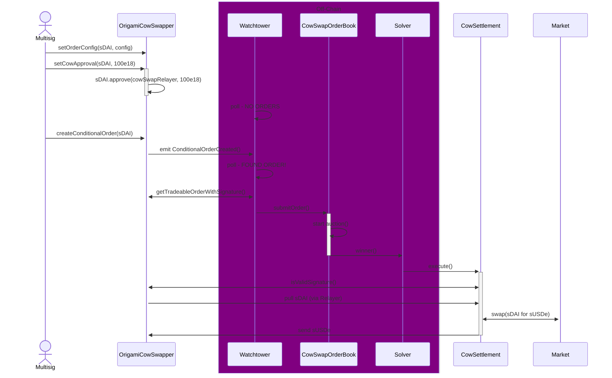

# Swappers Docs

# Origami Cow Swapper

[CoW Swap](https://swap.cow.fi/) is known to get best execution through `asynchronous` off-chain auctions, where solvers submit bids for the right to execute swaps.

This flow helps both scaling for new types of assets to trade across many venues, and also it can lead to better execution due to concensus of wants (Bob and Alice want opposite trades - this can happen without paying DEX fees).

This ordinarily requires users sign messages representing the order -- either off-chain via an EOA/multisig (synchronous) or on-chain via a multisig transaction (asynchronous). Since contracts cannot sign these messages, this flow cannot work.

However CoW Swap also now supports [ERC-1271](https://cow.fi/learn/eip-1271-explained), via the [Programmatic Order Framework](https://cow.fi/learn/introducing-the-programmatic-order-framework-from-cow-protocol)

This allows us to configure and then create CoW swap orders based from on-chain decisions. eg:

- Oracle price is over a threshold
- DAI Balance in wallet is > 100
- etc

This becomes quite a powerful tool, however there are also some constraints to carefully consider.

To reiterate - this is only useful for `ASYNCHRONOUS` swaps. They are not atomic since they execute via off-chain solvers. So if a swap is required within a flashloan (for example) then a regular dex aggregator swap needs to be used (eg 1inch, KyberSwap, 0x)

## Overview



- [CowSwapOrderBook](https://github.com/cowprotocol/services): This is the CoW API responsible for taking new order requests and orchestrating the auction process
 `Solvers`: The participants in the auction - they are responsible for submitting bids, and then if they are the winning bidder they must execute the trade, via the `CowSettlement` contract
- [CowSettlement](https://github.com/cowprotocol/contracts/blob/main/src/contracts/GPv2Settlement.sol): The onchain settlement contract. As part of this, it asks the `OrigamiCowSwapper` to verify that the signature is legitimate.
- [Watchtower](https://github.com/cowprotocol/watch-tower): An off-chain bot listing to `ConditionalOrderCreated()` events (from any contract on mainnet). It subsquently queries that contract for new discrete orders to place by calling `getTradeableOrderWithSignature()`, and then submits these orders to the `CowSwapOrderBook`.
- [OrigamiCowSwapper](./OrigamiCowSwapper.sol): This handles the logic on what discrete orders to place and the subsequent verification of them.
- `Origami Multisig`: Elevated access to:
  - Update any configuration required to decide what orders to place
  - Set ERC20 approval limits to cow swap
  - Register to cow swap's Watchtower that we want it to start monitring our contract.

## Handling Discrete Orders & Avoiding Spam Orders

A new order is placed if any of the fields in the [CoW Swap GPv2Order](https://github.com/cowprotocol/contracts/blob/5957d67d69df231c6a879ec7b64806181c86ebb6/src/contracts/libraries/GPv2Order.sol#L11) change when `Watchtower` calls `getTradeableOrderWithSignature()`.

Watchtower polls every 5 seconds, so careful attention needs to be given to these fields to ensure discrete orders are placed at the intended times. For example:

- `buyAmount`: If this is intended as a limit order, and `buyAmount` will change over time (eg dependant on an onchain oracle), then it may need to round down to a discrete step (eg round down to the nearest 10 DAI).
  - That way when `Watchtower` polls frequently the unrounded `buyAmount` may change, but the rounded `buyAmount` won't as much.
  - An example [here](./OrigamiCowSwapper.sol#316)
- `validTo`: Represents the expiry date (UNIX timestamp) of the order.
  - Simply having `block.timestamp + 300 seconds` is not enough, since that will roll forward every time it's called - resulting in non-unique orders.
  - The solution is to [bucket these timestamps into time windows](./OrigamiCowSwapper.sol#355)

## Order Configuration

Both LIMIT orders and MARKET orders are supported, using the same configuration struct.

Configured for a given `sellToken`:

| Config Item                    | Description                                                                                                                                                                                                                                                                                                                                                                                                                                     | Intended for MARKET orders                                                                                             | Intended for LIMIT orders                                                        |
| ------------------------------ | ----------------------------------------------------------------------------------------------------------------------------------------------------------------------------------------------------------------------------------------------------------------------------------------------------------------------------------------------------------------------------------------------------------------------------------------------- | ---------------------------------------------------------------------------------------------------------------------- | -------------------------------------------------------------------------------- |
| maxSellAmount                  | The amount of sellToken to place an order for <br>  MUST be > 0 <br> This can be set to a higher amount than the current balance the contract holds. <br> CoW swap will still work and sell as much as it can, up until the order expiry.                                                                                                                                                                                                       | :white_check_mark:                                                                                                     | :white_check_mark:                                                               |
| buyToken                       | The IERC20 token to buy. <br> MUST NOT be address(0) <br> MUST NOT be the same as `sellToken`                                                                                                                                                                                                                                                                                                                                                   | :white_check_mark:                                                                                                     | :white_check_mark:                                                               |
| minBuyAmount                   | The minimum amount of buyToken to purchase in the order <br> Note this is total order size, not each individual fill <br> MUST be > 0                                                                                                                                                                                                                                                                                                           | :white_check_mark:                                                                                                     | :x: <br> Can still be set to have an absolute floor under the `limitPriceOracle` |
| partiallyFillable              | True if partial fills are ok, false for a 'fill or kill'                                                                                                                                                                                                                                                                                                                                                                                        | :white_check_mark: <br> Generally should be `false` for market orders                                                  | :white_check_mark:                                                               |
| useCurrentBalanceForSellAmount | True if the order sellAmount should be determined from the current `sellToken.balanceOf(address(this))` (capped to the maxSellAmount). <br> False if the order sellAmount should just use the `maxSellAmount`                                                                                                                                                                                                                                   | :white_check_mark: <br> Generally should be `true` for market orders                                                   | :x: <br> Generally should be `false` for limit orders                            |
| limitPriceOracle               | The origami oracle to lookup the limit order price. <br> Not used if set to address(0)                                                                                                                                                                                                                                                                                                                                                          | :x:                                                                                                                    | :white_check_mark:                                                               |
| limitPricePremiumBps           | How many basis points premium above the `limitPriceOracle` is the limit order set. <br> Not used if set to zero                                                                                                                                                                                                                                                                                                                                 | :x:                                                                                                                    | :white_check_mark:                                                               |
| roundDownDivisor               | When specifying the order for watchtower, the buyAmount is rounded down to the nearest specified divisor. <br> This is to ensure we have discrete unique orders, rather than spamming CoW swap with slightly different orders (which may get us on the deny list) <br> Specified in full precision in the buyToken decimals <br> Eg if buyToken is 18dp, to round down to the nearest 50 tokens, set this to 50e18 <br> Not used if set to zero | :x: <br> Since buyAmount isn't dependant on an oracle, it shouldn't be changing over time (except for config updates)  | :white_check_mark:                                                               |
| verifySlippageBps              | The acceptable slippage (in basis points) to the unrounded buyAmount between <br> T1. The order being picked up by watchtower. <br> T2. It being verified and added to the cow swap order book. <br> Not used if set to zero                                                                                                                                                                                                                    | :x:  <br> Since buyAmount isn't dependant on an oracle, it shouldn't be changing over time (except for config updates) | :white_check_mark:                                                               |
| expiryPeriodSecs               | The expiryPeriodSecs time window, used to set the expiry time of any new discrete order. <br> `expiryPeriodSecs=300 seconds` means that an order as of 13:45:15 UTC will have an expiry of the nearest 5 minute boundary, so 13:50:00 UTC                                                                                                                                                                                                       | :white_check_mark:                                                                                                     | :white_check_mark:                                                               |
| recipient                      | The receiver of buyToken's on each fill.                                                                                                                                                                                                                                                                                                                                                                                                        | :white_check_mark:                                                                                                     | :white_check_mark:                                                               |
| appData                        | The appData for any new discrete orders. <br> It refers to an IPFS blob containing metadata, but also controls the pre and post hooks to run upon settlement. <br> This is set on the contract in advance to avoid incorrect setting. <br> NOTE: There are constraints around hooks - study the docs                                                                                                                                            | :white_check_mark:                                                                                                     | :white_check_mark:                                                               |

## Order Verification

`OrigamiCowSwapper` needs to verify any orders being placed. It trusts the `CowSettlement` to do this (the trust is granted by any ERC20 token approval).

This verification is done by [ERC-1271](https://eips.ethereum.org/EIPS/eip-1271)

Without this validation, any actor may submit orders on this contracts behalf. So if that happens (and if there's an ERC20 approval for that token given to CoW Swap) then the order may be unintentionally executed

When `Watchtower` calls [getTradeableOrderWithSignature()](./OrigamiCowSwapper.sol#173), `OrigamiCowSwapper` will first run validation on the order and then return both:

- The discrete order to place
- A custom signature representing the order and any other params it wants to be passed into the verification.

Then when `CowSettlement` calls the [isValidSignature()](./OrigamiCowSwapper.sol#221), that signature (and a hash of the original order) is verified.

It is important for `isValidSignature()` to validate all fields in the provided order hash are as expected. So it should reconstruct the order and then validate that the GPv2 order hash (using CowSwap's `domainSeparator`) is identical.

Now, since there may be a delay between when the order is placed (by `Watchtower`) and when the order is verified during settlement, those order parameters may change. For example the `buyAmount` or `validTo`.

It is up to the contract implement to verify that these are either exactly the same or within a tolerance range of the initial order that was placed.

Any extra information required for these checks can be added into the signature within `getTradeableOrderWithSignature()`. For example we provide the [unrounded buyAmount](./OrigamiCowSwapper.sol#215) in order to check that directly, since the GPv2 order itself only contains the pre-rounded buyAmount (to avoid spam as above)

## Constraints

1. `CowSwapOrderBook`:
   1. The order book may reject the order or the sender entirely - it's up to watchtower on how it responds to that.
   2. The contract must have at least 1 WEI of balance of the sell token for the order to be placed.
2. `Watchtower`:
   1. If `getTradeableOrderWithSignature()` reverts with OrderNotValid() or an unknown error, then watchtower will stop monitoring the contract.
      1. To start monitoring again, `ConditionalOrderCreated()` event must be emitted again.
   2. The contract may revert with `PollTryAtBlock()` or `PollTryAtEpoch()` to give a hint on when to try again in case of delay
   3. Order spam is not tolerated - care needs to be taken not to create a huge amount of orders.
      1. It may kick the contract out (again can be started again by emitting `ConditionalOrderCreated()`)
   4. If `CowSwapOrderBook` rejects because there's no sellToken balance on the contract, then `Watchtower` will sleep for 10 minutes before trying again.

## App Data

Each order may have metadata associated with it, which can be seen within the [CoW Swap Explorer](https://explorer.cow.fi)

Eg on [this order](https://explorer.cow.fi/orders/0xf556971294bcb124123e1272c6f7cc58ee948b8b4e9b4716e8cd9c384b0efaf4c582c92c4f7e6af76dab4b376da34ddd3cd3eb4166da29e0?tab=overview)

```json
{
  "appCode": "https://origami.finance/",
  "metadata": {
    "hooks": {
      "version": "0.1.0"
    }
  },
  "version": "1.1.0"
}
```

Given by the IPFS hash: `0x0609da86e2234e72a1e230a0591bec8a3c2e99c9f47b60e6bb41df96e9097dbf`

This metadata can be added via the [CoW Orderbook API](https://docs.cow.fi/cow-protocol/reference/apis/orderbook), via `/api/v1/app_data`

And then specified via the order config when calling `setOrderConfig()` on the `OrigamiCowSwapper`

## Hooks

Cow swap orders also have the ability to have [pre and post execution hooks](https://docs.cow.fi/cow-protocol/reference/core/intents/hooks#specification)

However there are a number of constraints which render them a bit useless:

1. pre-hooks are only called once for a given order, before the first fill.
   1. If it's a 'fill or kill' order then that's probably ok.
   2. If it's a 'partially fillable' order then it won't be called on each fill
   3. post-hooks are called on each fill.
2. hooks aren't guaranteed to be called at all. It's a social concensus for solvers to fill this out (and they can get slashed for not following the rules, but this is quite vague and ther are no formal CoW Swap specs)
   1. For 'pre-hooks' these can be somewhat enforced by only giving token approval within the pre-hook.
   2. So the only way the tx can execute is by calling this pre-hook. Any other logic can then be guaranteed to be called
   3. There isn't a similar enforcement for 'post-hooks'.
3. Order and fill information context isn't passed through to the hook calldata.
   1. So we cannot easily track amounts received for example. Some options to do this might include:
   2. a/ Get the balance pre-hook and post-hook (can use transient storage). The difference is the received amount...this cannot work for 'partially fillable' orders, since pre-hook isn't called on each fill.
   3. b/ Perhaps delegate to another contract within the post-hook: send any balance to another contract and call some function.
4. The hooks need to grant access to the `CowSettlement` contract. This needs to be validated that no one else requires access, however it also involves MORE trust to be granted to that contract.

## Watchtower

CoW Swap run their own instance of Watchtower. However it is only on a 'best efforts' basis.

For any critical load, we may want to consider running our own instance and having monitoring around this.

The central CoW swap instance will continue to run and pick up this order too -- there's no issue with this, since the CoW swap Orderbook will just report a duplicate, and watchtower will skip.

This adds resilience then - picked up by both our instance and the CoW swap instance.

To run, within the [Watchtower](https://github.com/cowprotocol/watch-tower) repo:

```bash
LOG_LEVEL=TRACE yarn cli run --config-path ./config.json
```

Where the config can look like (example for Sepolia)

```json
{
    "networks": [
        {
            "name": "sepolia",
            "rpc": "wss://eth-sepolia.g.alchemy.com/v2/XXX",
            "deploymentBlock": 6636278,
            "watchdogTimeout": 3000,
            "filterPolicy": {
                "defaultAction": "DROP",
                "owners": {
                  "0x5C5e0c5d8c800dbB497CF3fcd90d9a050A3A4F58": "ACCEPT"
                }
            }
        }
    ]
}
```

This could can be forked to tweak timing parameters, add resilience, observability (or discord hooks), etc.
