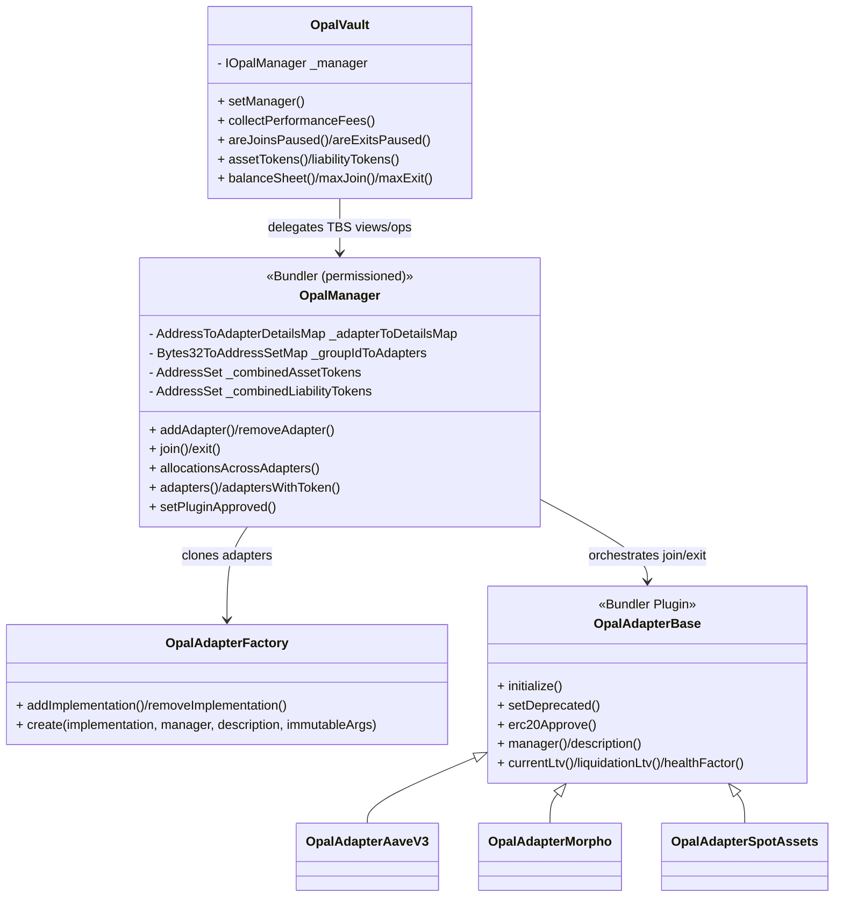
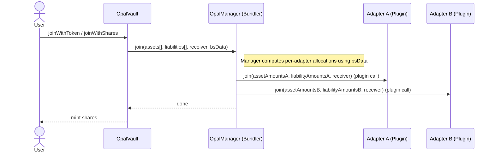

# OPAL architecture

OPAL is Origami’s “Tokenized Balance Sheet” vault architecture for managing a portfolio of assets and liabilities across multiple money‑market integrations (“adapters”), with a single ERC‑20 share token at the vault level.

At a glance:

- OpalVault tokenizes the portfolio and exposes the TBS V2 interface.
- OpalManager aggregates adapter balance sheets, computes portfolio limits, and executes join/exit allocations. It is also a Bundler instance used for permissioned rebalances.
- Adapters are protocol integrations (e.g., Aave V3, Morpho) deployed as minimal clones with immutable args. Each adapter is also a Bundler Plugin and can be called in managed rebalance bundles.
- OpalAdapterFactory whitelists implementations and produces clones with immutable arguments (Solady).

## Relationships

## Flows (Simplified)

- Join/exit: Vault receives user intent, forwards to Manager with balance-sheet data; Manager allocates across adapters proportionally to existing balances; adapters execute.
- Managed rebalance: Elevated Access uses Manager.multicall([...]) to call adapter plugin actions and approved external plugins in one atomic bundle (see [BUNDLER-OVERLAP](./BUNDLER-OVERLAP.md)).

## Key technical aspects

- Minimal clones with immutable args (Solady)
  - Adapters are deployed via OpalAdapterFactory using LibClone.clone with immutable args appended to runtime code.
  - Immutable args read at runtime via ClonesImmutableReader (e.g., manager address, description, protocol‑specific params).
  - Benefits: gas‑efficient deployment, per‑instance configuration without storage writes.

- Bundler/plugin security model
  - Plugins guard all operations with withApprovedBundler; for adapters, the approved bundler is the OpalManager.
  - Manager’s multicall is restricted to Elevated Access (permissioned rebalances).
  - Plugins can reenter the bundler (e.g., flashloan callbacks) but are constrained by a predeclared reentry hash.

- Aggregated token sets and mapping
  - Manager maintains combined assetTokens and liabilityTokens across all active adapters (order can change on removal).
  - Per‑adapter index maps link each adapter’s token layout to the combined layout; these maps are re‑synced on mutations.

- Group‑aware capacity accounting
  - Adapters expose a groupId so Manager can treat multiple adapters as sharing the same underlying capacity (e.g., same Aave instance).
  - maxJoin/maxExit scale per‑adapter capacities by portfolio balances across shared groups to avoid over‑allocation into capped venues.

- Fee mechanics in the vault
  - OpalVault accrues a time‑based performance fee (annualPerformanceFeeBps, capped by MAX_PERFORMANCE_FEE_BPS = 1,000 = 10%).
  - collectPerformanceFees() mints new shares to feeCollector based on accrued amount.

- Bounded portfolio size/complexity
  - MAX_ADAPTERS = 10; MAX_TOKENS = 10 at the Manager level; MAX_FEE_BPS = 330 (3.3%) for join/exit fees at the Manager.

## Complex logic explained

1) Allocation across adapters for join/exit

- Input: target aggregate delta (assets[], liabilities[]) and a snapshot of both aggregate and per‑adapter balance sheets (bsData).
- Idea: Keep the existing relative composition (proportional to current balances) while applying the new deltas.
- Method:
  - For each token T, split the aggregate delta across adapters that hold T in proportion to each adapter’s current balance of T.
  - Round down per adapter; assign the final “dust” unit to the last adapter holding T to ensure exact sum equality.
- Result: Deterministic, proportional allocation that respects the current portfolio mix and adapter token layouts.

1) Group‑aware maxJoin/maxExit

- Some adapters share underlying protocol limits (e.g., multiple adapters pointed at the same Aave pool or same Morpho market family).
- Each adapter declares a groupId; for a given token T, Manager scales adapter capacities by combined balance within the group of T.
- Intuition: Portfolio total capacity for T is constrained by the smallest per‑group effective capacity, then distributed proportionally.

1) Token index mapping and resync

- Manager maintains adapter‑to‑combined token index maps (for both assets and liabilities).
- On adapter removal (swap‑and‑pop) or token‑set changes, Manager resynchronizes maps so the join/exit math always references the correct indices.

1) Manager as Bundler (permissioned rebalances)

- For complex, multi‑step rebalances (intra‑adapter leverage changes; inter‑adapter migrations), Elevated Access composes Manager.multicall([...]) bundles:
  - Adapter plugin calls (supply/withdraw/borrow/repay)
  - External plugins (EntryPoint, KyberSwap, TBS V1/V2, AaveV3Flash)
  - Optional nested reentry guarded by callback hashes
- This unifies OPAL’s internal adapter actions with the general plugin ecosystem while keeping rebalance powers permissioned.
