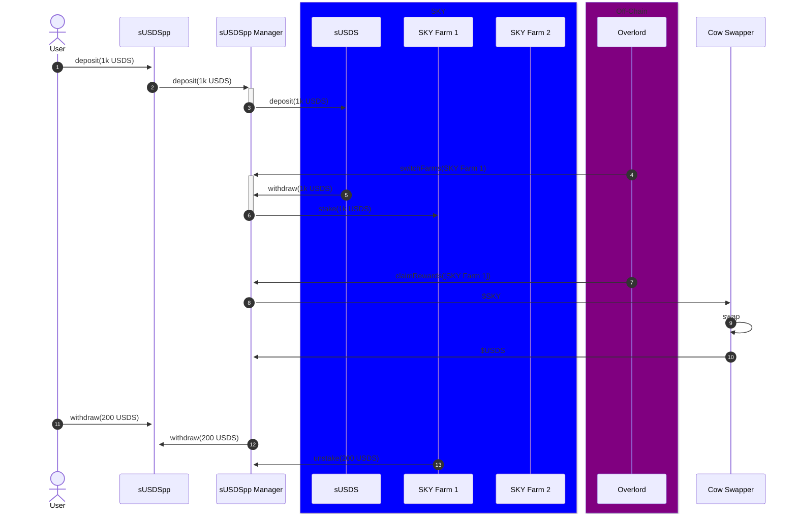

# Sky Vaults

## Sky sUSDS++ Vault

### Overview

1. `USDS` is the new stablecoin from MakerDAO (now rebranded as Sky).
2. `sUSDS` is the new equivalent of `sDAI`.
   1. An ERC-4626 vault where users deposit USDS to earn a savings rate of interest, controlled by Sky governance.
   2. There are no deposit/exit fees or lockup periods
3. Sky is also creating new Synthetix style staking contracts, where:
   1. Users deposit USDS
   2. They earn tokens (per second accrual) which can be claimed
   3. There are no deposit/exit fees or lockup periods

Sky will be creating multiple versions of the staking contracts. The first one will be to stake `$USDS` to earn `$SKY`, the new governance token (equivalent to `$MKR`). Each Sky SubDAO may have it's own new staking contract too.

This vault aims to auto-optimize this farming:

1. Users deposit `USDS` into our Origami ERC-4626 vault
   1. No deposit/exit fees, nor supply caps
2. Origami will deposit that `USDS` into the currently active farm, either:
   1. `sUSDS`;
   2. One of the `Staking` contracts
3. Overlord will periodically check which of these has the highest yield, and switch farms based on some critiera.
4. Users can exit at any time from the vault - Origami will withdraw from the currently active farm.

If farming in a staking contract, these tokens can be periodically claimed and sold for USDS.

### High Level Flow

### Example

* sUSDS rate: 6% (fixed yield paid every block in `USDS`, autocompounds)
* SKY farm rate: Variable - depends on the `SKY/USDS` exchange rate, the `SKY` rewards per second and the amount of `USDS` currently staked.

600 Million `SKY` is awarded yearly, so if `SKY` price is 0.07 USDS and the USDS TVL is 600 Million then the APR would be 7% (0.07*600 Mill SKY/600 Mill TVL)

In this case the `sUSDS++` vault would ensure all the USDS is farming SKY, harvesting it and selling it for more USDS.

### Parameters

* Yield Cliff: +0.5%
  * The new farm APY must be +0.5% respect to the old one.
  * If DSR APY is 6% it means that whenever farming SKY APY goes above 6.5% it'd switch to that and whenever farming SKY gives an APY of 6% or lower it'd switch back to plain DSR.
  * Same logic would apply for switching to farm other tokens whenever that happens
* Deposit Fee: 0% (immutable)
* Exit Fee: 0% (immutable)
* Max Supply: infinite (immutable)
* Performance Fees: 5% total from harvested rewards from the staking contracts (not sUSDS yield)
  * 1% of harvested rewards to the user calling the function (this will be Origami to start - but anyone can call)
  * 4% of harvested rewards to Origami treasury
  * 95% back to the vault
  * The 5% total cannot be increased, however it can be reduced or the split can be changed (eg more to the caller, less to Origami treasury)
* Farm Switch Cooldown: 24 hours - but can be increased or decreased.

### Origami ERC-4626 Vault

This vault breaks from convention for Origami vaults, in that it will be an ERC-4626 vault. This main driver for this is because:

1. It's a single deposit and exit token
2. There is no slippage
3. We want to ensure maximum integration uptake across the ecosystem

This work will allow future vaults to be ERC-4626 vaults too, if deemed appropriate.

Features added to this [Origami ERC-4626 vault](../../common/OrigamiErc4626.sol):

* Permit
* Always have the decimal places of the vault be 18
* Ability to add deposit/withdraw fees (in shares), benefiting existing vault holders
* ERC165 support
* Reentrancy guard on deposit/mint/withdraw/redeem.
* Ability to set max total supply
* deposit/withdraw hooks added to easily make use of the funds just in time.

### Immutable Parameters

Access to change these contracts should be limited. Once the contract has been deployed for a while, and access control has settled to the operational norm, then the ownership can be revoked leaving just the granular 'extra' access granted for particular functions.

Required long term Origami access required to:

* Add/Remove farms, or updating referral code's
* Pause/Unpause
* Recover tokens (except for USDS/sUSDS belonging to the vault)
* Update performance fee split (or reduce total)
* Set the fee collector
* Update the swapper contract
* Set the cooldown period between switching farms
* Switching farms (overlord)
* Set the TokenPrices contract (just used for FE)

### Incentives to Claim Rewards

Rather than relying on Origami to claim rewards, incentives are given for users to permisionlessly call and claim rewards to subsidize gas costs.

Both Origami Treasury and the caller receives the rewards in-kind of that farm's native rewards, eg `$SKY`

### CoW Swapper

In order to efficiently swap `$SKY` and other reward tokens back to `USDS`, the [CoW Swapper programmatic orders](../../common/swappers/README.md) will be used.

Parameters are tuned for a `MARKET` order with a min buy amount in USDS terms. This can be updated:

* sellToken: SKY
* maxSellAmount: 1,000,000 SKY
* buyToken: USDS
* minBuyAmount: 1,000 USDS
* partiallyFillable: False
* limitPriceOracle: N/A
* limitPricePremiumBps: N/A
* roundDownDivisor: N/A
* verifySlippageBps: N/A
* expiryPeriodSecs: 5 minutes
* recipient: `sUSDS++ manager` contract
* appData: Origami's default metadata: `0x0609da86e2234e72a1e230a0591bec8a3c2e99c9f47b60e6bb41df96e9097dbf`

This means as soon as there's enough SKY balance in the swapper, and it will result in 1,000 USDS (inclusive of fees) then it will be executed.

The USDS is sent directly back to the `sUSDS++ manager`, and will contribute to the share price at that point.

The USDS will be re-invested into the current farm on the next user deposit (or if Origami switches farms)

The deposit() function on the manager contract can also be permissionlessly called which will deposit any idle funds into the current farm.
