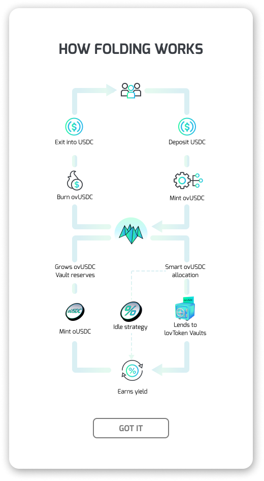
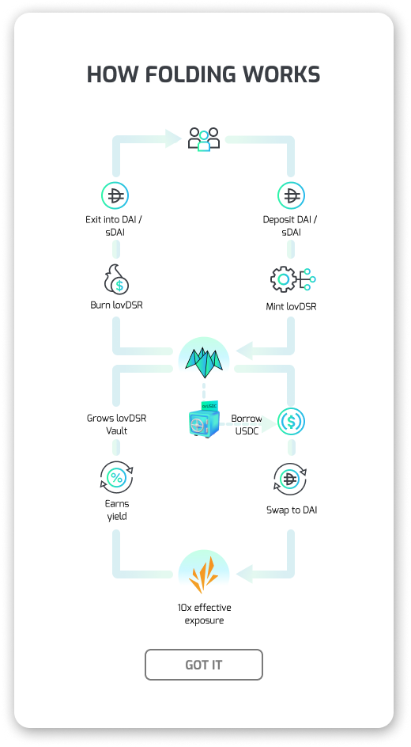

# Origami lovToken

- [Origami lovToken](#origami-lovtoken)
  - [Origami lovToken Background](#origami-lovtoken-background)
      - [Example 1 Typical Vault Flow on Origami](#example-1-typical-vault-flow-on-origami)
  - [How Origami Achieves Its Targeted Delta Exposure - A lovDSR Example](#how-origami-achieves-its-targeted-delta-exposure---a-lovdsr-example)
      - [Example 2 Deposits and Loans Affect the A/C Ratio and the A/L Ratio](#example-2-deposits-and-loans-affect-the-ac-ratio-and-the-al-ratio)
    - [Yield For Liquidity Providers Comes From Accrued USDC Interest](#yield-for-liquidity-providers-comes-from-accrued-usdc-interest)
    - [Borrower Interest is Variable and Determined by Capital Utilisation Ratio](#borrower-interest-is-variable-and-determined-by-capital-utilisation-ratio)
      - [Example 3 Interest Rate Calculations for lovToken Strategy Vaults](#example-3-interest-rate-calculations-for-lovtoken-strategy-vaults)
    - [Exit Liquidity Is Constrained By Available Liquidity in the Idle Strategy](#exit-liquidity-is-constrained-by-available-liquidity-in-the-idle-strategy)
    - [lovDSR User Gains and Losses Are Reflected in the Share Price](#lovdsr-user-gains-and-losses-are-reflected-in-the-share-price)
      - [Example 4: lovDSR Share Price Calculations](#example-4-lovdsr-share-price-calculations)
    - [lovDSR will Utilise RebalanceUp/Down to Maintain Target Exposure](#lovdsr-will-utilise-rebalanceupdown-to-maintain-target-exposure)
    - [ovUSDC vault will Utilise Borrow Caps To Allocate Available Liquidity](#ovusdc-vault-will-utilise-borrow-caps-to-allocate-available-liquidity)
  - [Fortune Favours the Fold](#fortune-favours-the-fold)

## Origami lovToken Background

Origami's newest product aims to create leveraged delta positions for any target yield strategy by creating an internal money market framework for borrowers to access lender liquidity. The Leveraged Origami Vault -- or lovToken Strategy Vault allows users to achieve leveraged exposure to any single-asset yield strategy such as Dai Savings Rate.

In the lovToken framework, vaults can be generalised into 3 types:

1. **Liquidity Provider**: A non-leveraged 'Liquidity Provider' vault such e.g. oUSDC or oUSDT, or a 3rd party money market such as Aave or Spark. The Liquidity Provider vault will utilise both an idle strategy e.g. Spark Protocol and a Lending strategy i.e. lovDSR to generate yield for its depositors through repricing shares;
1. **Target Strategy**: A non-leveraged, single-asset auto-compounding staking yield strategy vault e.g. DSR that generates yield for its depositors through repricing shares.
1. **LovToken**: A leveraged vault that takes user deposits to collateralize loans from (1) to enter a leveraged position for (2) and pay borrow interest to (1) as yield. Target Strategy gains and losses accrue to the holders through repricing shares.

Three key factors affect the capital efficiency and scalability of the LovToken framework. First, the reserve asset in the Liquidity Provider vault (LP) should exhibit deep liquidity and a broad base of users (LP) who wish to receive yield in the same asset e.g. USDC and USDT. Second, there must exist a scalable single-asset yield strategy such as the Dai Savings Rate that is highly resistant to dilution and supports high TVL. And lastly, there should be high user demand to lever up on the Target Strategy from depositors to drive collateralized lending demand.

The first lovToken vault is Leveraged Origami Vault for DSR, or lovDSR. The reserve token in the lovDSR vault is Spark DAI (sDAI). The lovDSR vault will take user deposits in DAI or sDAI to collateralize USDC loans from the ovUSDC vault. The borrowed USDC --which is a *Liability* to the lovDSR vault-- will be sold into sDAI to provide lovDSR depositors with leveraged exposure by acquiring more *Assets* in the Target Strategy. lovDSR's targeted exposure in the ovDSR vault lies within a range centered at 10.0. This range implies that over time, the lovDSR user has on average 10 DAI long delta exposure for every 1 DAI deposited. In exchange for providing leverage, the ovUSDC vault LP will receive a yield in oUSDC --Origami's liquid wrapper for USDC-- that is highly competitive with other money market options whilst maintaining their desired single-asset exposure to USDC.

#### Example 1 Typical Vault Flow on Origami

> 1. Bob deposits USDC into the ovUSDC vault (Vault Strategy is both "Idle Yield Strategy" and "lovDSR Lending Strategy")
>    1. The ovUSDC vault will mint oUSDC at 1:1 and return vault shares (ovUSDC) to Alice based on the current share price in oUSDC
>    1. Vault reserve oUSDC is backed 1:1 by USDC or iUSDC (see iUSDC Section Below)
> 1. Alice deposits DAI (or sDAI) to the lovDSR vault
>    1. The lovDSR vault will deposit the DAI to Spark to receive sDAI in return and mint vault shares (lovDSR) to Bob based on the current share price in sDAI
>    1. The lovDSR token itself is a vault share with claims on the withdrawable portion of the reserve token (sDAI) held by the lovDSR vault
>    1. The lovDSR vault will increase its exposure to the DSR Strategy by borrowing USDC from ovUSDC vault to make new deposits into the Spark sDAI contract using lovDSR user deposits as collateral for the loan

Fig 1.
| ovUSDC | lovDSR |
| ------ | ------ |
|  |  |

## How Origami Achieves Its Targeted Delta Exposure - A lovDSR Example

The lovDSR vault tracks both its `Assets` and `Liabilities` in terms of sDAI. The lovDSR vault assets i.e. its Total sDAI balance can be parsed into *non-withdrawable* (amount reserved to back its USDC debt) and *withdrawable* (amount that is used to determine the price for lovDSR token holders). The price of lovDSR in sDAI terms is what determines gains and losses for lovDSR holders. Additionally, the vault's `Asset / Collateral` ratio can be calculated to assess the Delta Exposure i.e. Effective Exposure. The Collateralization or `Asset / Liability` ratio of the current vault position can be used to determine the health of its USDC loan.

#### Example 2 Deposits and Loans Affect the A/C Ratio and the A/L Ratio

> lovDSR vault has 300 sDAI (30 from user deposits and 270 acquired from borrowed USDC)
>
> - A / L = 300 / 270 = 1.1111
>   - Effective Exposure is 300 / 30 or 10X delta for sDAI
> - Alice deposits another 30 sDAI into the vault
> - A/L = 330 / 270 or 1.2222
>   - Effective Exposure is 330 / 60 or 5.5X delta for sDAI
> - RebalanceDown() is called and lovDSR takes a new loan to acquires another 270 sDAI
> - A/L = 600 / 540 or 1.11111
>   - Effective Exposure is 600 / 60 or 10X delta for sDAI

- `lovDSR Asset = Total_sDAI = User_Deposited_sDAI + Financed_sDAI`
  - sDAI will always reprice up in terms of DAI due to yield accrual
  - Asset value will increase in DAI terms
- `lovDSR Liability = Total_USDC_Debt` (priced in sDAI terms using Chainlink Price Oracle)
  - Liability includes any accrued interest (iUSDC)
- `lovDSR Collateral = lovDSR Asset - lovDSR Liability` (priced in sDAI terms)

A new DAI or sDAI deposit into the lovDSR vault will revert if the transaction would (1) move the A/L ratio above a set upper threshold; and (2) there is insufficient available USDC to borrow to bring the A/L ratio back into nominal range. This will mitigate over-deleveraging which will dilute the yield for current lovDSR holders. Similarly, a lovDSR withdrawal will revert if the transaction would move the A/L ratio below a set lower threshold. This will mitigate the credit risk stemming from ovUSDC obligations. These settings will help ensure consistent delta exposure for lovDSR users to the underlying Strategy whilst protecting oUSDC liquidity providers.

### Yield For Liquidity Providers Comes From Accrued USDC Interest

The USDC LP will receive both yield and principal denominated in oUSDC (backed 1:1 by either iUSDC or USDC). A rebasing debt token called iUSDC is minted when the ovUSDC vault initially transfers the USDC to the lovDSR vault. Rebased iUSDC represents anticipated oUSDC yield for ovUSDC holders. This new token allows Origami to track the accrued interest that is continuously compounded against the initial USDC principal. The rebase rate of iUSDC is based on utilisation of available ovUSDC lending capacity. The iUSDC is burned or transferred to the idle strategy when the lovDSR vault repays the loan by selling its sDAI to USDC, and transfering the USDC tokens back to the ovUSDC vault.

### Borrower Interest is Variable and Determined by Capital Utilisation Ratio

The iUSDC interest rate model is based on capital utilisation ratio (UR) where interest rate rises at a relatively flat slope before the kink (from 0 to 90% utilisation), and at a much faster slope after the kink e.g. between 90% and 100% utilisation. This is also known as the `2 curves + kink` interest rate model. Whilst lovDSR will target utilisation at 90% of available USDC at the kink, it is possible for 100% of the USDC capital to be borrowed. For example, the iUSDC interest rate for lovDSR maybe be at 5-10% when UR is < 95%, but jumps to 15% when UR is at 98%. The increased cost of capital in the system will drive the ovUSDC APY higher and incentivize new USDC deposits. Higher borrow cost may also force repayment from worse performing lovToken vaults to efficiently reallocate capital between these different leveraged Strategies.

#### Example 3 Interest Rate Calculations for lovToken Strategy Vaults

> - `BorrowerSpecificUtilisationRatio = iUSDC.balanceOf(lovToken) / BorrowCap`
> - `GlobalUtilisationRatio = oUSDC.totalBorrowed() / GlobalAvailableToBorrow`

There are two utilisation ratios to consider for the lovToken framework. One is the utilisation ratio of the ovUSDC vault itself i.e. all available USDC liquidity, and the other is the utilisation of the "Max Debt Ceiling" which is set manually respective of the credit risk for that particular lovToken vault. It is possible for the UR% for the lovDSR to be at 100% whilst the UR% for the ovUSDC vault is far lower. It is also possible for UR% for lovDSR to be above 100% due to accrued iUSDC interest which is added to the ratio's numerator along with the original loan principal. In the case where one interest rate is higher than the other, `max(global_rate, specific_rate)` will be used. In the long run, we would expect the two rates to converge internally within Origami, and also for the system rates to converge with the cost of external capital rates outside Origami.

At each on chain action, the iUSDC balance for the lovDSR vault will be updated. Then the ovUSDC vault will mint oUSDC based on the change to the accrued iUSDC balance since the last mint. The new oUSDC will not be minted all at once but rather "dripped" over a period of time to smooth out the yield for ovUSDC depositors.

### Exit Liquidity Is Constrained By Available Liquidity in the Idle Strategy

The reserve token for the oUSDC vault is oUSDC and each oUSDC is redeemable for 1 USDC. The oUSDC vault will mint additional oUSDC when new deposits enter the vault, or when yield accrues through the idle strategy, or borrow interest from lovToken vaults. When new deposits enter the oUSDC vault, the funds are directed to a designated USDC Strategy --also known as the Idle Strategy-- that *is not* lending to a lovToken vault. An appropriate Idle Strategy could be AAVE v3 USDC money market, or simply holding the liquid USDC tokens.

The liquid USDC held by the oUSDC vault in the Idle Strategy is the single source of available liquidity for lovToken vaults (borrows) and user withdrawals (oUSDC redemptions). The ovUSDC holder should note that not all of the oUSDC reserves are immediately redeemable for liquid USDC. If there is insufficient USDC liquidity to completely redeem any particular ovUSDC withdrawal, the oUSDC vault will allow only up to the currently available USDC to be redeemed. The remaining ovUSDC will remain in the user's vault balance until new USDC liquidity materialises in the system through yield accrual or new deposits.

### lovDSR User Gains and Losses Are Reflected in the Share Price

When the growth of Vault Assets exceeds the growth of Liabilities in DAI terms, the share price for lovDSR will increase to generate positive expected returns. When the opposite is true, the share price for lovDSR will fall and there will be an unrealized loss for users. See this [worksheet](https://docs.google.com/spreadsheets/d/1sEDYkt9hogk_wOA1vXyFttt7lA2x5VCXRZKiXdly4kY/edit?usp=sharing) for additional details for how the vault share price fluctuates as a result of lovDSR vault actions.

To mitigate the possibility of bad debt, the lovDSR contract will place a "hold" on its sDAI reserves. This "availableToWithdraw" reserve amount is calculated in real-time via a ChainLink Oracle. It follows then that the reserveTokenPrice is calculated as the "availableToWithdraw" sDAI divided by the current global supply of lovDSR tokens.

In a scenario where DAI is falling against USDC, the sDAI reserved as collateral may rise and thus cause lovDSR share price to fall. This is due to the fact that more sDAI is being withheld to back the same USDC loan in sDAI terms. If the situation resolves in DAI re-pegging against USDC, then the share price will rise as the additional withheld ovDSR is released.

#### Example 4: lovDSR Share Price Calculations

> - `vaultSharePrice = availableToWithdraw / lovDSR.totalSupply()`
> - `availableToWithdraw = total_sDAI_reserves - reservesToPayDebt`
> - `reservesToPayDebt = oUSDC_debt \* (1 + buffer) / reserveTokenPrice`
>
> The *buffer* is an arbitrary safety margin (e.g. 0.1%) to mitigate risk of loss due to slippage or other market scenarios that could adversely impact the ability  of any lovToken vault to repay its debt. However the buffer may also cause the lovDSR price to drop as additional collateral ovDSR are reserved by lovDSR to > back new USDC loans. This effect is usually temporary as new DAI yield should eventually cover the additional withholding.

### lovDSR will Utilise RebalanceUp/Down to Maintain Target Exposure

The lovDSR contract has a RebalanceUp (repay) method and a RebalanceDown (borrow) method. A bot will utilise off-chain logic to call these methods when feasible. Specifically, the lovDSR contract will borrow USDC when the A/L ratio rises above a ceiling of 1.12 and repay USDC when A/L ratio falls below a floor of 1.08. These parameters are adjustable. Other lovToken vaults will exhibit similar behaviour for their particular reserve asset and preferred Target Strategy. We should note that the lovToken contract is designed to minimise the number of Rebalance transactions to mitigate Volatility Drift, which tends to have a negative impact on user returns. Volatility Drift has less impact on Strategies with a stable underlying asset, but could be significant for a more volatile Target Strategy.

lovDSR RebalanceDown *may* be called when A/L moves significantly above 1.1111 due to:

- DSR yield growing faster than the accrued borrower interest
- New user deposits in the lovDSR vault

When RebalanceDown is called, lovDSR will:

- Borrow USDC from ovUSDC
- Sell the USDC to DAI
- Deposit the DAI into Spark to generate more sDAI reserves

lovDSR RebalanceUp *may* be called when A/L moves significantly below 1.1111 due to:

- DSR yield growing slower than the accrued borrower interest
- User withdrawals in the lovDSR vault
- A desire to reduce DSR exposure due to DAI or USDC depeg

When RebalanceUp is called, lovDSR will:

- Unwrap sDAI to redeem DAI
- Sell the DAI back to USDC
- Send USDC to ovUSDC

### ovUSDC vault will Utilise Borrow Caps To Allocate Available Liquidity

The total oUSDC reserve represents the theoretical capital controlled by the ovUSDC vault. Whilst the ovUSDC vault may utilise an idle strategy to allocate its liquidity, the lovDSR vault may also borrow up to 100% of the available USDC in the ovUSDC vault. However, the leverage available to the all lovToken contracts including lovDSR is constrained by:

1. **Daily Borrow Cap** which is applied globally across all lovToken vaults that can borrow USDC from the ovUSDC vault; and
2. **Max Borrow Cap** which is set per lovToken vault in a bespoke manner.

Whilst the interest rate model helps to allocate available capital between vaults to maximise capital efficiency, the borrow caps and circuit breaker create capital friction that promotes system stability. The Daily Borrow Cap represents a de facto circuit breaker to stem unusually high lending demand from the ovUSDC vault that could spike credit risk to the system. Similarly the Max Borrow Cap constrains the maximum ovUSDC LP exposure to any single lovToken, and is also used as the denominator to determine the specific utilisation ratio (see interest model discussion above). These caps are set manually in consideration of the maximum acceptable credit risk in the system as well as the available ovUSDC lender liquidity.

## Fortune Favours the Fold

Origami unfolds to reveal a powerful and flexible vault paradigm that allows users to apply leverage to their favourite single-asset farming strategy. The lovToken vault framework is designed to maximise capital efficiency whilst minimising risk of liquidation and bad debt. Whilst only the lovDSR Strategy via Spark DAI (sDAI) and lovSTETH Strategy via Lido will be available at launch, lovToken framework can be tailored to fit any compatible liquid staking yield Strategy. A most notable example being lovBGT strategies on Berachain.
